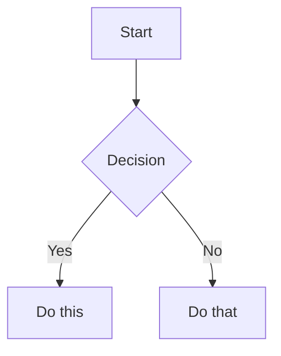

# Obsidian-Flavored Markdown

Obsidian extends CommonMark and GFM. This covers only Obsidian-specific extensions — standard Markdown is assumed.

## Internal Links (Wikilinks)

```markdown
[[Note Name]]                          Link to note
[[Note Name|Display Text]]             Aliased link
[[Note Name#Heading]]                  Link to heading
[[Note Name#^block-id]]                Link to block
[[#Heading]]                           Same-note heading link
```

Use `[[wikilinks]]` for vault-internal links. Obsidian tracks renames automatically. Use `[text](url)` only for external URLs.

## Block IDs

Append `^block-id` to any paragraph to make it linkable:

```markdown
This paragraph can be referenced. ^my-block-id
```

For lists and quotes, place the block ID on a separate line after:

```markdown
> A quote block

^quote-id
```

Reference with: `[[Note#^my-block-id]]`

## Embeds

Prefix any wikilink with `!` to embed inline:

```markdown
![[Note Name]]                         Embed full note
![[Note Name#Heading]]                 Embed section
![[image.png]]                         Embed image
![[image.png|300]]                     Image with width
![[document.pdf#page=3]]               Embed PDF page
```

See [embeds.md](embeds.md) for audio, video, search embeds, and external images.

## Callouts

```markdown
> [!note]
> Basic callout.

> [!warning] Custom Title
> With a custom title.

> [!faq]- Collapsed by default
> Foldable content (- collapsed, + expanded).
```

Common types: `note`, `tip`, `warning`, `info`, `example`, `quote`, `bug`, `danger`, `success`, `failure`, `question`, `abstract`, `todo`.

See [callouts.md](callouts.md) for the full list with aliases, nesting, and custom CSS.

## Highlights

```markdown
==highlighted text==
```

## Comments

```markdown
Visible %%but this is hidden%% text.

%%
Entire hidden block in reading view.
%%
```

## Tags

```markdown
#tag                    Inline tag
#nested/tag             Nested tag with hierarchy
```

Tags can contain letters, numbers (not first char), underscores, hyphens, forward slashes. Also defined in frontmatter: `tags: [tag1, tag2]`.

## Math (LaTeX)

```markdown
Inline: $e^{i\pi} + 1 = 0$

Block:
$$
\frac{a}{b} = c
$$
```

## Diagrams (Mermaid)

````markdown

````

Link Mermaid nodes to Obsidian notes with `class NodeName internal-link;`.

## Footnotes

```markdown
Text with a footnote[^1].

[^1]: Footnote content.

Inline footnote.^[This is inline.]
```

## Complete Example

````markdown
---
date: 2026-03-15
tags:
  - project
hubs:
  - "[[_MOC-Strategy]]"
urls: []
---

# Project Alpha

This project aims to [[improve workflow]] using modern techniques.

> [!important] Key Deadline
> The first milestone is due on ==January 30th==.

## Tasks

- [x] Initial planning
- [ ] Development phase

## Notes

The algorithm uses $O(n \log n)$ sorting. See [[Algorithm Notes#Sorting]].

![[Architecture Diagram.png|600]]

Reviewed in [[Meeting Notes 2024-01-10#Decisions]].
````
